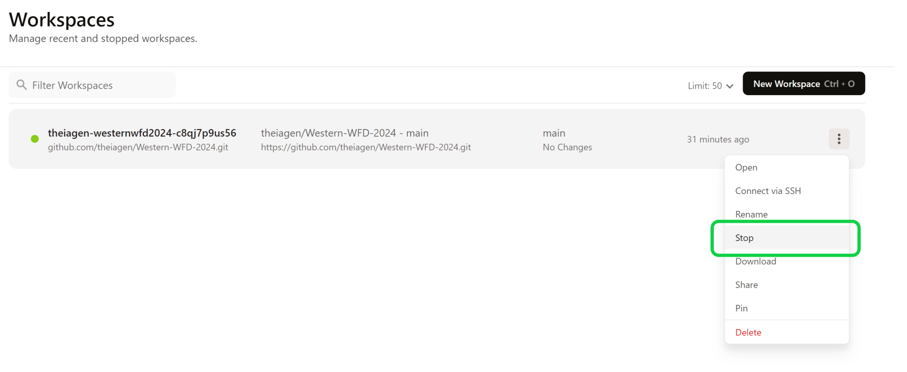

# Theiagen Dev-Assessment
This repository was created to assess a candidate's technical capabilities as a bioinformatics software developer. 

## Prerequisites for Technical Dev Assessment:

### GitHub Account
If you don't already have a GitHub account, please go to github.com and register (it's free!)
  - Once you have registered, ensure you are signed into your account on github.com

### GitPod Account 
- Navigate to https://gitpod.io/
- Select "Continue with GitHub", authorize Gitpod to access your GitHub account, and sign in with your credentials

### GitPod Workspace
  - Navigate to your Workspaces tab and select New Workspace

  

  - Set the repository to the name of this workspace: https://github.com/theiagen/dev-assessment/
  - Select the default Editor and default Class, click "Continue"

🚨**NOTE**🚨 Once you're finished working, make sure to shut down your workspace to save your allotted free hours (50hr/month) in GitPod. There are a few ways to stop your workspace from running:
- In GitPod environment (VSCode interface), click on the orange Gidpod in bottom left corner. Select "Stop Workspace"

  

- Navigate to https://gitpod.io/, find your workspace in the list, click on the three-dot button, and select "Stop" 

  

